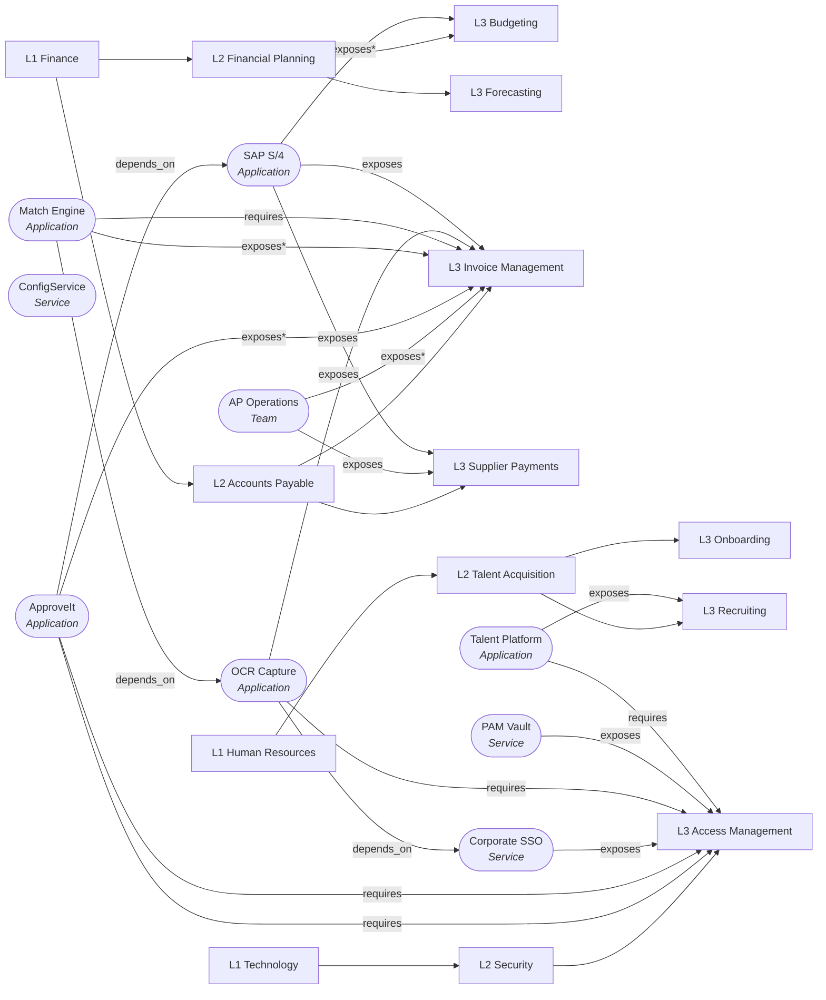

```mermaid
flowchart LR
  ncap_Finance["L1 Finance"]
  ncap_Finance_Financial_Planning["L2 Financial Planning"]
  ncap_Finance --> ncap_Finance_Financial_Planning
  ncap_Finance_Financial_Planning_Budgeting["L3 Budgeting"]
  ncap_Finance_Financial_Planning --> ncap_Finance_Financial_Planning_Budgeting
  ncap_Finance_Financial_Planning_Forecasting["L3 Forecasting"]
  ncap_Finance_Financial_Planning --> ncap_Finance_Financial_Planning_Forecasting
  ncap_Finance_Accounts_Payable["L2 Accounts Payable"]
  ncap_Finance --> ncap_Finance_Accounts_Payable
  ncap_Finance_Accounts_Payable_Invoice_Management["L3 Invoice Management"]
  ncap_Finance_Accounts_Payable --> ncap_Finance_Accounts_Payable_Invoice_Management
  ncap_Finance_Accounts_Payable_Supplier_Payments["L3 Supplier Payments"]
  ncap_Finance_Accounts_Payable --> ncap_Finance_Accounts_Payable_Supplier_Payments
  ncap_Human_Resources["L1 Human Resources"]
  ncap_Human_Resources_Talent_Acquisition["L2 Talent Acquisition"]
  ncap_Human_Resources --> ncap_Human_Resources_Talent_Acquisition
  ncap_Human_Resources_Talent_Acquisition_Recruiting["L3 Recruiting"]
  ncap_Human_Resources_Talent_Acquisition --> ncap_Human_Resources_Talent_Acquisition_Recruiting
  ncap_Human_Resources_Talent_Acquisition_Onboarding["L3 Onboarding"]
  ncap_Human_Resources_Talent_Acquisition --> ncap_Human_Resources_Talent_Acquisition_Onboarding
  ncap_Technology["L1 Technology"]
  ncap_Technology_Security["L2 Security"]
  ncap_Technology --> ncap_Technology_Security
  ncap_Technology_Security_Access_Management["L3 Access Management"]
  ncap_Technology_Security --> ncap_Technology_Security_Access_Management
  nent_AP_Operations(["AP Operations<br/><i>Team</i>"])
  nent_ApproveIt(["ApproveIt<br/><i>Application</i>"])
  nent_ConfigService(["ConfigService<br/><i>Service</i>"])
  nent_Corporate_SSO(["Corporate SSO<br/><i>Service</i>"])
  nent_Match_Engine(["Match Engine<br/><i>Application</i>"])
  nent_OCR_Capture(["OCR Capture<br/><i>Application</i>"])
  nent_PAM_Vault(["PAM Vault<br/><i>Service</i>"])
  nent_SAP_S_4(["SAP S/4<br/><i>Application</i>"])
  nent_Talent_Platform(["Talent Platform<br/><i>Application</i>"])
  nent_AP_Operations -->|exposes| ncap_Finance_Accounts_Payable_Supplier_Payments
  nent_AP_Operations -->|exposes*| ncap_Finance_Accounts_Payable_Invoice_Management
  nent_ApproveIt -->|requires| ncap_Technology_Security_Access_Management
  nent_ApproveIt -->|requires| ncap_Technology_Security_Access_Management
  nent_ApproveIt -->|exposes*| ncap_Finance_Accounts_Payable_Invoice_Management
  nent_ApproveIt -->|depends_on| nent_SAP_S_4
  nent_Corporate_SSO -->|exposes| ncap_Technology_Security_Access_Management
  nent_Match_Engine -->|exposes*| ncap_Finance_Accounts_Payable_Invoice_Management
  nent_Match_Engine -->|requires| ncap_Finance_Accounts_Payable_Invoice_Management
  nent_Match_Engine -->|depends_on| nent_OCR_Capture
  nent_OCR_Capture -->|requires| ncap_Technology_Security_Access_Management
  nent_OCR_Capture -->|exposes| ncap_Finance_Accounts_Payable_Invoice_Management
  nent_OCR_Capture -->|depends_on| nent_Corporate_SSO
  nent_PAM_Vault -->|exposes| ncap_Technology_Security_Access_Management
  nent_SAP_S_4 -->|exposes| ncap_Finance_Accounts_Payable_Invoice_Management
  nent_SAP_S_4 -->|exposes| ncap_Finance_Accounts_Payable_Supplier_Payments
  nent_SAP_S_4 -->|exposes*| ncap_Finance_Financial_Planning_Budgeting
  nent_Talent_Platform -->|requires| ncap_Technology_Security_Access_Management
  nent_Talent_Platform -->|exposes| ncap_Human_Resources_Talent_Acquisition_Recruiting
```
